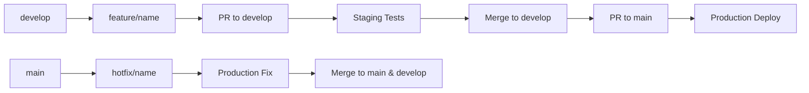

# Git Branching & Deployment Strategy

## 🌳 Branch Strategy

### **Branch Types:**
- `main` - Production deployments
- `develop` - Staging/integration testing
- `feature/name` - Feature development
- `hotfix/name` - Production emergency fixes
- `release/v1.0.0` - Release preparation

### **Naming Conventions:**
```
feature/modal-webrtc-streaming
feature/user-authentication
feature/video-processing-optimization
hotfix/memory-leak-fix
hotfix/cors-policy-update
release/v1.2.0
bugfix/dropdown-styling
```

## 🚀 Deployment Mapping

### **Frontend (Vercel)**
| Branch | Environment | URL |
|--------|-------------|-----|
| `main` | Production | `memetic-demo.vercel.app` |
| `develop` | Staging | `memetic-demo-staging.vercel.app` |
| `feature/*` | Preview | `memetic-demo-pr-{number}.vercel.app` |

### **Backend (Render)**
| Branch | Environment | URL |
|--------|-------------|-----|
| `main` | Production | `memetic-backend.onrender.com` |
| `develop` | Staging | `memetic-backend-staging.onrender.com` |
| `feature/*` | Manual Only | Not auto-deployed |

### **Modal Services**
| Branch | Environment | Service Names |
|--------|-------------|---------------|
| `main` | Production | `memetic-demo-prod`, `memetic-webrtc-prod` |
| `develop` | Staging | `memetic-demo-staging`, `memetic-webrtc-staging` |
| `feature/*` | Preview | `memetic-demo-{branch}`, `memetic-webrtc-{branch}` |

## 📋 Environment Variables

### **Production (.env.production)**
```env
USE_MOCK_MODAL=false
MODAL_BASE_URL=https://memetic-demo-prod.modal.run
MODAL_WEBRTC_URL=https://memetic-webrtc-prod.modal.run
NODE_ENV=production
```

### **Staging (.env.staging)**
```env
USE_MOCK_MODAL=false
MODAL_BASE_URL=https://memetic-demo-staging.modal.run
MODAL_WEBRTC_URL=https://memetic-webrtc-staging.modal.run
NODE_ENV=staging
```

### **Development (.env)**
```env
USE_MOCK_MODAL=true
MODAL_ENDPOINT_URL=http://modal:9000
NODE_ENV=development
```

## 🔄 Workflow

### **Feature Development:**
1. Create feature branch from `develop`
2. Develop & test locally
3. Push → Auto-deploy preview environments
4. Create PR to `develop`
5. Test in staging environment
6. Merge to `develop`
7. Create PR from `develop` to `main`
8. Deploy to production

### **Hotfixes:**
1. Create hotfix branch from `main`
2. Fix issue
3. Deploy directly to production
4. Merge back to both `main` and `develop`

### **Releases:**
1. Create release branch from `develop`
2. Final testing & bug fixes
3. Update version numbers
4. Merge to `main`
5. Tag release
6. Deploy to production

## 🛠 Service Configuration

### **Vercel Projects:**
- **memetic-demo** (Production) → `main` branch
- **memetic-demo-staging** (Staging) → `develop` branch
- **Preview deployments** → All feature branches

### **Render Services:**
- **memetic-backend** (Production) → `main` branch
- **memetic-backend-staging** (Staging) → `develop` branch

### **Modal Apps:**
- Connect repository with branch-specific deployments
- Use environment variables to differentiate configs

## 🚨 Best Practices

### **Branch Protection:**
- Require PR reviews for `main` and `develop`
- Require status checks to pass
- No direct pushes to `main`

### **Testing Strategy:**
- Unit tests run on all branches
- Integration tests on `develop` and `main`
- End-to-end tests on staging before production

### **Deployment Gates:**
- Manual approval required for production deployments
- Automated deployments for staging/preview
- Rollback strategy for production issues

### **Monitoring:**
- Different logging levels per environment
- Separate analytics/monitoring for each environment
- Health checks for all deployed services

## 📊 Branch Lifecycle



This strategy ensures:
- ✅ Safe production deployments
- ✅ Isolated feature development
- ✅ Proper testing at each stage
- ✅ Easy rollbacks and hotfixes
- ✅ Clear environment separation
