# Modal Auto-Deployment Setup

This repository is configured for **automatic deployment to Modal** whenever you push changes to the `modal-service/` directory.

## 🚀 Quick Setup

### 1. **Get Modal API Credentials**
```bash
# Install Modal CLI
pip install modal

# Login to Modal (this will give you your tokens)
modal setup
```

### 2. **Add Secrets to GitHub Repository**
Go to your GitHub repository → Settings → Secrets and variables → Actions

Add these secrets:
- `MODAL_TOKEN_ID`: Your Modal token ID
- `MODAL_TOKEN_SECRET`: Your Modal token secret

### 3. **Enable Auto-Deployment**
That's it! Now when you push to `main` branch, your Modal services will automatically deploy.

## 📋 How It Works

### **Automatic Deployment Triggers:**
- ✅ Push to `main` or `production` branch → **Deploys to production**
- ✅ Push to feature branches → **Validates code only**
- ✅ Pull requests → **Deploys preview environment**
- ✅ Manual trigger → **Deploy anytime via GitHub Actions**

### **Deployment Environments:**
- **Production**: `memetic-demo-main` and `memetic-webrtc-main`
- **Development**: `memetic-demo-dev` and `memetic-webrtc-dev`
- **Preview**: `memetic-demo-preview-{branch}` and `memetic-webrtc-preview-{branch}`

## 🔧 Environment Configuration

After deployment, update your backend environment variables:

```env
# Production settings
USE_MOCK_MODAL=false
MODAL_BASE_URL=https://your-modal-app-url.modal.run
MODAL_WEBRTC_URL=https://your-webrtc-app-url.modal.run
```

The GitHub Action will automatically show you the URLs after deployment!

## 🏃 Manual Deployment (if needed)

```bash
cd modal-service

# Deploy main service
modal deploy modal_service.py --name memetic-demo-main

# Deploy WebRTC service  
modal deploy webrtc_service.py --name memetic-webrtc-main

# Check deployment status
modal app list
```

## 🧪 Testing

### **Local Testing:**
```bash
cd modal-service

# Validate services
modal app validate modal_service.py
modal app validate webrtc_service.py

# Run locally
modal serve modal_service.py
```

### **Preview Environments:**
- Create a Pull Request → Automatic preview deployment
- Test your changes in isolation
- Preview environments auto-cleanup when PR closes

## 📊 Monitoring

### **Check Deployment Status:**
- GitHub Actions tab → See deployment progress
- Modal Dashboard → Monitor app performance
- Deployment summary → Get service URLs

### **Logs:**
```bash
# View Modal app logs
modal app logs memetic-demo-main
modal app logs memetic-webrtc-main
```

## 🚨 Troubleshooting

### **Common Issues:**

1. **"Modal token not found"**
   - Check GitHub Secrets are set correctly
   - Verify token ID and secret are valid

2. **"Deployment failed"**
   - Check the GitHub Actions logs
   - Validate your Modal code locally first

3. **"Service not accessible"**
   - Check the deployment URLs in GitHub Actions output
   - Verify environment variables are updated

### **Getting Help:**
1. Check GitHub Actions logs for detailed error messages
2. Run `modal app validate` locally
3. Check Modal Dashboard for service status

## 🎯 Best Practices

1. **Always test locally first** before pushing
2. **Use feature branches** for development
3. **Review preview deployments** before merging
4. **Monitor Modal usage** to stay within limits
5. **Keep secrets secure** - never commit tokens

---

## 🔄 Workflow Summary

```mermaid
graph LR
    A[Push Code] --> B[GitHub Actions]
    B --> C[Validate Modal Code]
    C --> D[Deploy to Modal]
    D --> E[Update Environment URLs]
    E --> F[Ready for Production! 🚀]
```



Your Modal services will now auto-deploy and stay in sync with your repository! 🎉
