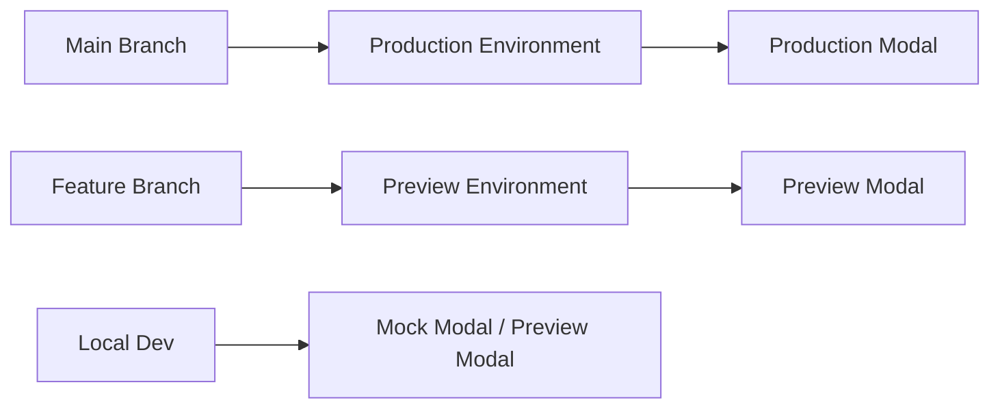

# Multi-Environment Modal Setup with GitHub Environments

This guide explains how to set up Modal tokens using GitHub Environments.

## 🏗️ **Environment Architecture**

### **GitHub Environments:**
1. **Production Environment** - Used for main branch deployments
2. **Preview Environment** - Used for feature branch validation
3. **Local Development** - Docker compose with mock or real Modal

## 🔑 **Modal Token Setup**

### **1. Generate Modal Tokens**

Create separate Modal tokens for each environment:

```bash
# Generate production tokens
modal token new --name "memetic-demo-production"

# Generate preview/development tokens  
modal token new --name "memetic-demo-preview"
```

### **2. GitHub Environments Setup**

#### **Create GitHub Environments:**
1. Go to your repository → **Settings** → **Environments**
2. Create two environments:
   - `production` 
   - `preview`

#### **Add Secrets to Each Environment:**

**Production Environment:**
- `MODAL_TOKEN_ID`: ak-your-production-token-id
- `MODAL_TOKEN_SECRET`: as-your-production-token-secret

**Preview Environment:**
- `MODAL_TOKEN_ID`: ak-your-preview-token-id  
- `MODAL_TOKEN_SECRET`: as-your-preview-token-secret

### **3. Render Backend Environment Variables**

Add these to your Render service environment variables:

```env
USE_MOCK_MODAL=false
MODAL_TOKEN_ID=ak-your-production-token-id
MODAL_TOKEN_SECRET=as-your-production-token-secret
MODAL_ENDPOINT_URL=https://your-production-modal-url.modal.run
```

## � **Deployment Flow**

### **GitHub Actions Workflow:**
- **Main branch push** → Uses `production` environment → Production Modal tokens
- **Feature branch push** → Uses `preview` environment → Preview Modal tokens
- **Pull requests** → Uses `preview` environment → Preview Modal tokens

### **Environment Isolation:**


## �📋 **Environment Configuration**

### **Local Development (Docker)**
File: `.env`
```env
USE_MOCK_MODAL=true
MODAL_ENDPOINT_URL=http://modal:9000
# No tokens needed - uses mock service
```

### **Local Development (Real Modal)**  
File: `.env.development`
```env
USE_MOCK_MODAL=false
MODAL_TOKEN_ID=ak-your-preview-token-id
MODAL_TOKEN_SECRET=as-your-preview-token-secret
MODAL_ENDPOINT_URL=https://your-preview-modal-url.modal.run
```

### **Production (Render)**
Environment Variables in Render:
```env
USE_MOCK_MODAL=false
MODAL_TOKEN_ID=ak-your-production-token-id
MODAL_TOKEN_SECRET=as-your-production-token-secret
MODAL_ENDPOINT_URL=https://your-production-modal-url.modal.run
```

## ✅ **Benefits of GitHub Environments**

1. **🔒 Security** - Environment-specific secrets
2. **🎯 Deployment targeting** - Automatic environment selection
3. **📊 Usage tracking** - Separate Modal usage per environment
4. **🚨 Isolation** - Preview testing doesn't affect production
5. **🔧 Environment protection** - Can add approval rules for production

## 🛠 **GitHub Environments vs Repository Secrets**

### **GitHub Environments (What You're Using):**
✅ Better organization
✅ Environment-specific secrets
✅ Deployment protection rules
✅ Clear separation of concerns

### **Repository Secrets (Alternative):**
❌ All secrets in one place
❌ Need different names (MODAL_TOKEN_ID_PROD, etc.)
❌ Less clear which environment uses what

## 🎯 **Your Current Setup is Correct!**

Your approach using GitHub Environments is actually the **best practice**:
- Same secret names (`MODAL_TOKEN_ID`, `MODAL_TOKEN_SECRET`) 
- Different values in different environments
- Clean workflow targeting with `environment: production` and `environment: preview`

This is exactly how it should be done! 🎉
